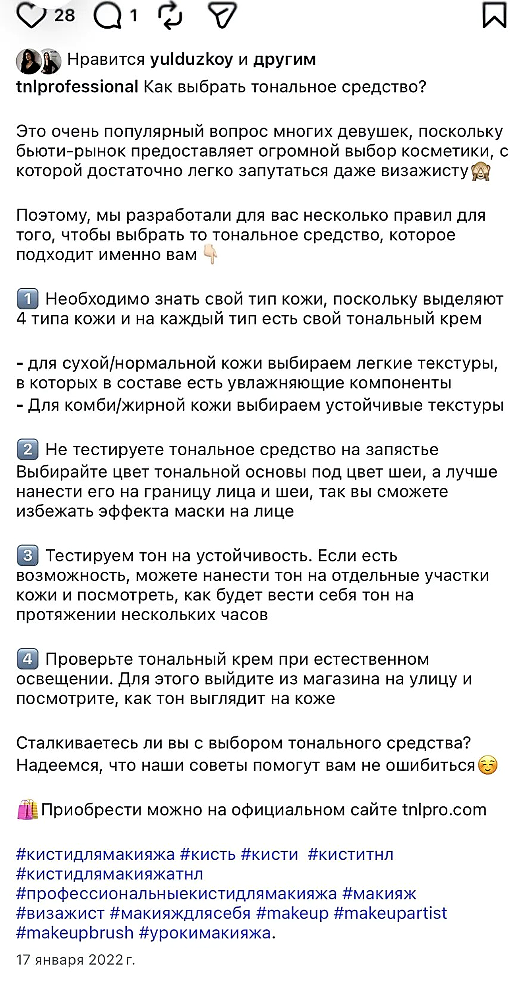
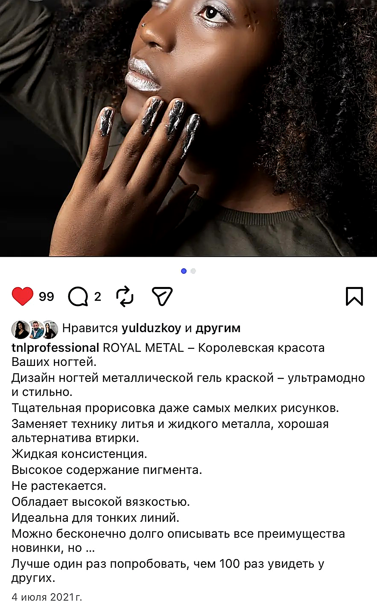
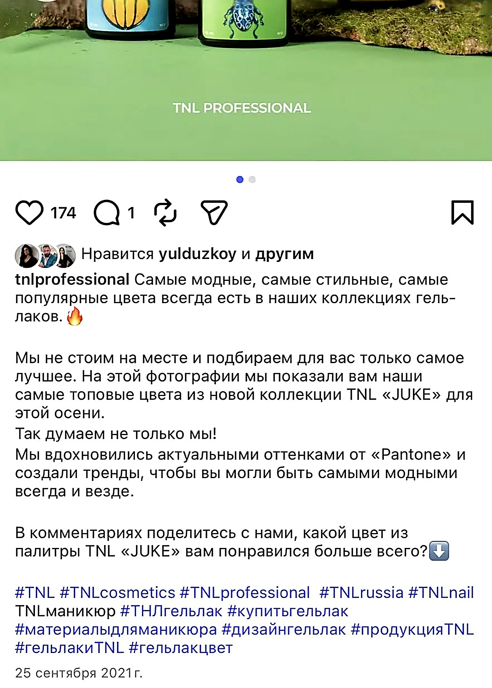
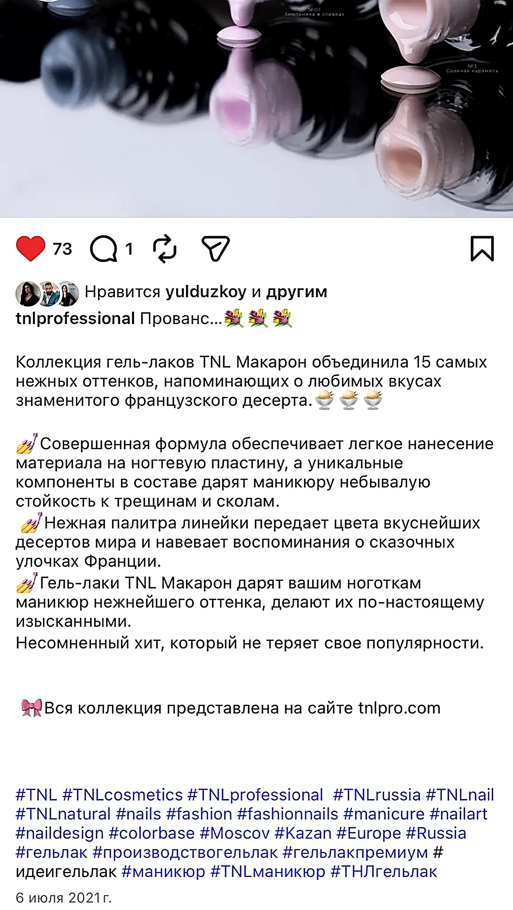
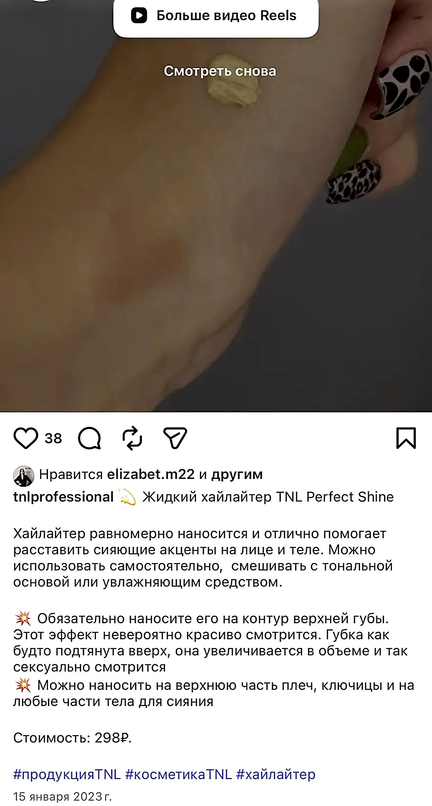
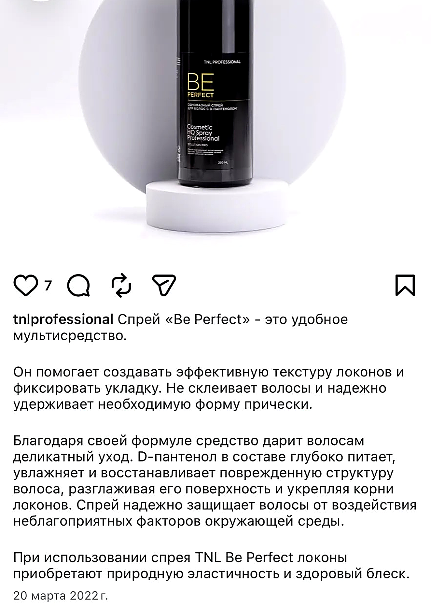

# TNL Professional — контент для бренда

В этом репозитории собраны посты для социальных сетей, написанные мной для бренда профессиональной косметики **TNL Professional**.

---

## Содержание

| № | Название | Описание |
|---|----------|----------|
| 1 | [Как выбрать тональное средство](TNL_как_выбрать_тон.png) | Советы по выбору тонального крема в зависимости от типа кожи |
| 2 | [Гель-лаки Tropical queen](Гель-лаки_Tropical_queen.png) | Насыщенные оттенки с эффектом тропических фруктов |
| 3 | [Гель-краска Royal Metal](Гель-краска_Royal_Metal_.png) | Металлическая гель-краска для дизайна ногтей |
| 4 | [Гель-лаки TNL JUKE](Гель-лаки_TNL_JUKE.png) | Коллекция осенних оттенков по мотивам Pantone |
| 5 | [Гель-лаки TNL Macaron](Гель-лаки_TNL_Macaron.png) | Нежная палитра в стиле французских десертов |
| 6 | [Хайлайтер Perfect Shine](Хайлайтер_Perfect_Shine.png) | Жидкий хайлайтер для сияющих акцентов на лице и теле |
| 7 | [Спрей Be Perfect](Спрей_Be_Perfect.png) | Мультисредство для укладки и ухода за волосами |

---

### Как выбрать тональное средство
Инфографика с советами по выбору тонального крема в зависимости от типа кожи.

---

### Гель-лаки Tropical queen
Яркая коллекция с тропическими оттенками и сочным дизайном.

---

### Гель-краска Royal Metal
Металлическая гель-краска для стильных и модных дизайнов.

---

### Гель-лаки TNL JUKE
Осенняя коллекция, вдохновлённая актуальными оттенками Pantone.

---

### Гель-лаки TNL Macaron
Нежные оттенки, напоминающие о французских десертах.

---

### Хайлайтер Perfect Shine
Жидкий хайлайтер для сияющих акцентов на лице и теле.

---

### Спрей Be Perfect
Мультисредство для укладки и ухода за волосами.

